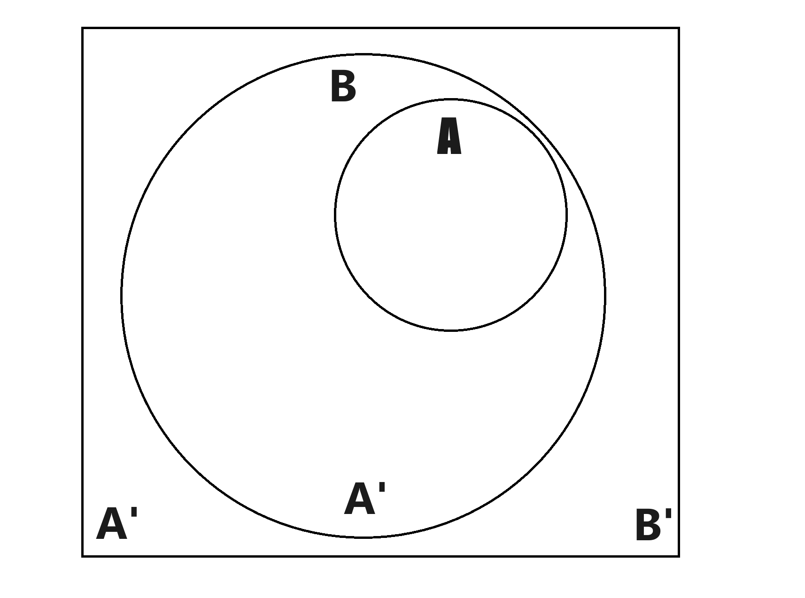
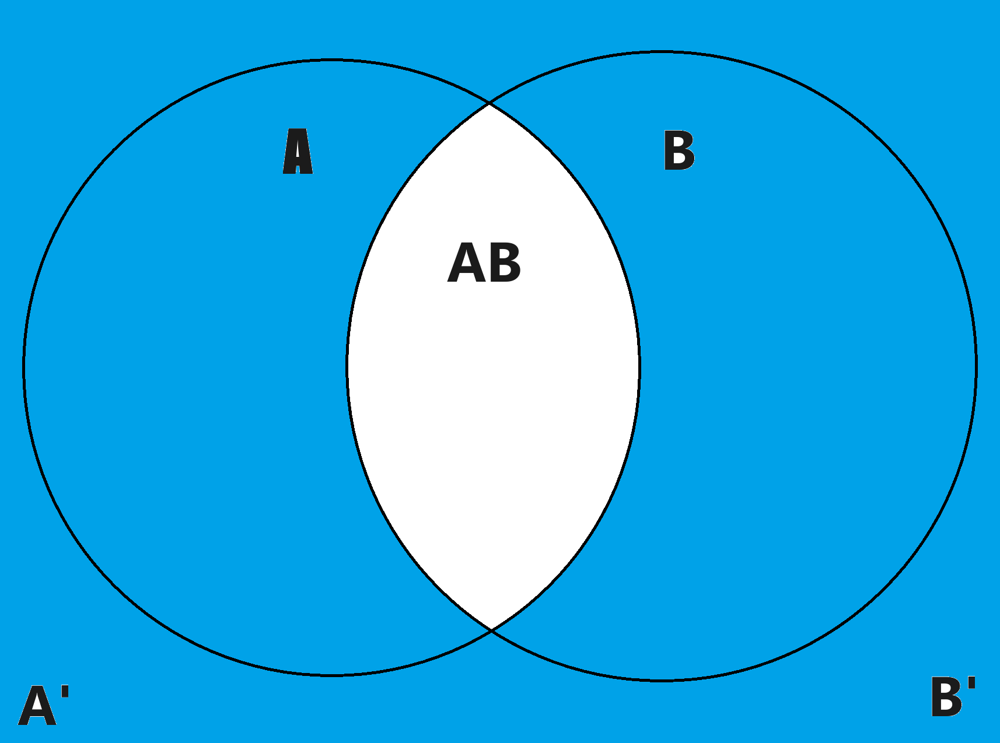
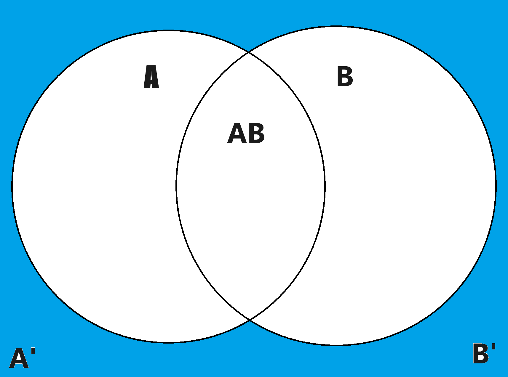

1. Validation would be similar to testing the model, and calibration would be modifying the model to create more accurate predictions that more closely match the natural phenomenon.
2. Features of the graphics like line-weight, color, and marker shapes.
3. The second one is more usable for red-green colorblind people.
4. a) Qualitative data with no certain order
b) Sequential, numerical data
c) Data that diverges from a center
d) Highlighting certain data points.
5. Experiment, theory, and computation and data.
6. They aren't the same thing. If it rained, then the rain wasn't the reason that there were clouds, it's only the logical consequence.
7. a) Not a very good fit, since the line only begins matching the data closely after 1950.
b) Epistemic, since the uncertainty was reduced with better knowledge and tools.
c) Positive correlation, as the temperature increases with time.
d) Yes, since it's a data series that uses time as the independent variable.
e) 0.0709 degrees.
8. Classical and Bayesian.
9. Frequentist.
10. Bayesian since it uses prior knowledge alongside data, and we have no data or concrete prior knowledge of God.
11. The horizontal axis starts before 0, even though that's not possible with age.
12. Integers are easy to represent in binary (usually).
13. B
14. Assembly
15. a) (A+B)' = A'B'     and (AB)' = A' + B'  
b) (C * (A + B))' --> C' + (A + B)' --> C' + A'*B'
16.   
b) This Venn Diagram shows A->B because if we know A is true, then we're also in the space where B is true. If we only know that B is true, A becomes more likely but not guaranteed.
c) The diagram also demonstrates B'->A' because if we're in the space where B is false, then we know that A is also false. But if we only know that A is false, we can't guarantee that B is also false because there is space where only A is false.
17. Deductive and plausible. Deductive reasoning assumes that propositions are either true or false, no inbetween. For example, in the case of implication A->B, if B is true then deductive reasoning would conclude that A must also be true. Plausible reasoning reasons that proposition can become more or less plausible. If A->B and B is true, plausible reasoning would conclude that A is now more likely.
18. Equal Boolean propositions means that they have the same truth value(s).
19.  
b) (AB)' refers to every space outside the intersection of A and B. A'B' refers to spaces where both A and B are false.
20. No, because certain float/integer values cannot be represented in binary without some sort of error or rounding.
21. 1683\. Add 3 and 99 together, multiply the sum by 33. Divide the product by 2 since pairing up means only half of those sums we've added together are unique. 