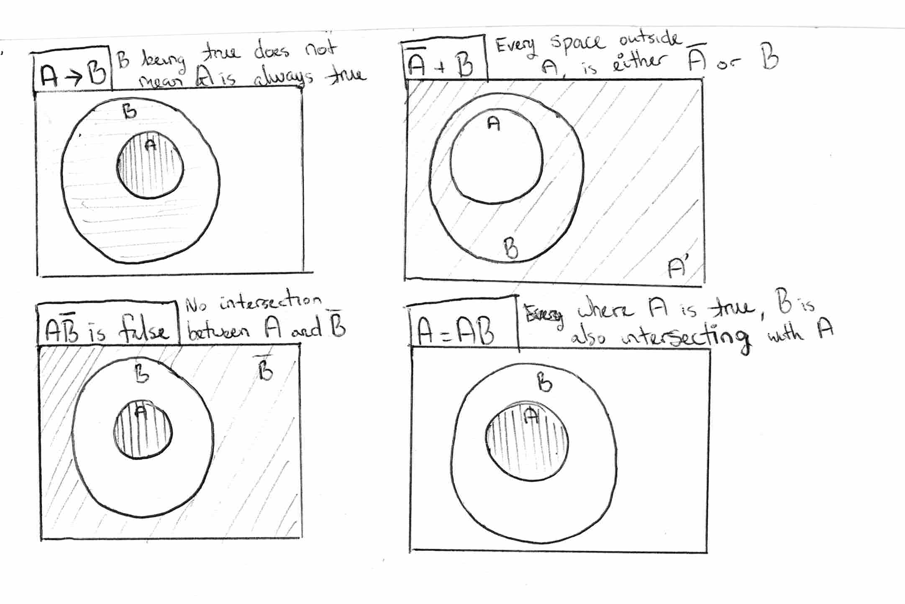
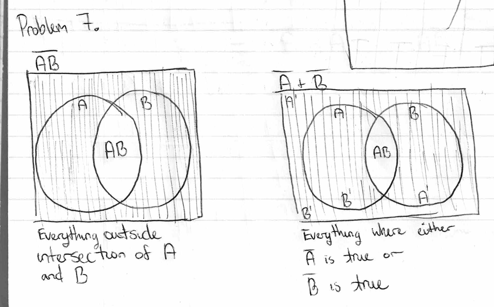

1. Experiment, theory, and computation-driven models.
2. Bioinformatics, which is using data science and tools to work with biological data. Engineering uses a lot of computational tools to run physics simulations and process data collected from those simulations. And the finance industry is constantly collecting data and creating market predictions with those data, which requires a lot of data science to accomplish.
3. Deductive and plausible
4. Car gets rear-ended -> Back bumper gets damaged. The bumper being damaged is a logical consequence of the rear-ending. But the bumper damage isn't the cause of the rear-ending. If we only knew that the bumper was damaged, that doesn't mean that the car was definitely rear-ended, but that a rear-ending is more likely.
5. The officer used plausible reasoning. If a burglar alarm sounds, and someone wearing a mask walks out of the store with a bag of jewelry, then the guy is the culprit. A and B -> C.
6. 
7. 
8. 
9. 
10. 
11. 
