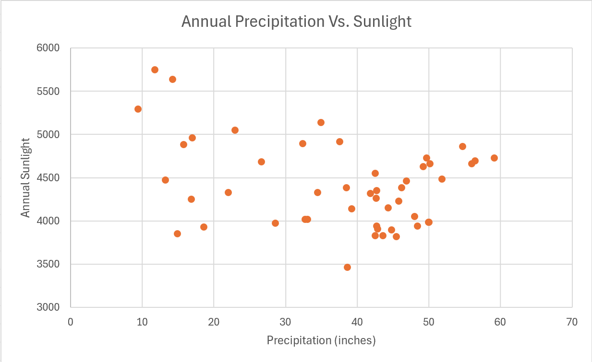

1. Aesthetics are features of visualizations that are mapped to values. Examples include color, line weight, and size of markers.
2. Continuous and discrete.
3. Discrete, such as dates or categories, and continuous, like heights.
4. Factors
5. GPA is an example of ordered data, and major is an example of unordered data.
6. I'd consider month and day to be quantitative, discrete and ordered. I would say they are numerical as well, since you can technically do 'math' with them and take intervals of months and dates. Location is qualitative, categorical, discrete, and unordered. Station ID is qualitative, since math operations with ID numbers don't usually work, categorical since they're made to distinguish, discrete, and unordered unless there is a pattern to how the ID was generated (For example, newer stations have a larger ID number). And lastly, temperature is quantitative, numerical, continuous, and ordered. 
7. When you're plotting two data series of the same unit, the axes should use the same units and the same grid size/spacing.
8. Projecting a 3d globe onto straight axes, like in the Cartesian projection, warps the map space near the poles. Curving the axes of projection lowers the warping.
9. The red and black grids are valid as the axes are parallel and don't appear to converge even as we extend it. The blue grid's horizontal axes converge into a single point, so data points that fall in that area won't be distinguishable from one another.
10. Periodical data like cycles of tide height.
11. Heat, which can be used to represent a range of temperatures. Carto Earth, which can be used to represent difference in elevation from sea level. ColorBrewer Blues can be used to show population density in an area. And ColorBrewer Accent, which can be used to highlight any data points of interest.
12. The horizontal axis, which is age, starts before 0 which isn't possible.
13. Colorblind people won't have problems reading the second color scale.
14.  
15. Honolulu, at an average of 77.37F, is hotter compared to Duluth's 40.41F.
16. Honolulu's temperature standard deviation is 3.39F. Compared to Duluth's 21.38F standard deviation, Honolulu's temperature fluctuates less throughout the year. 
17. 
18. Based on the scatterplot of TX populations, the approximate population of the 1000th most populous city is 0, or very close to it.
18b. After transforming the axes, the approximate population based off the graph is around 1000 people.

19. 
20. Classical, Bayesian, Frequentist, and Propensity.
21. I see a horse and a frog.
22. Move one matchstick from the 8 to turn it to 6, move the match stick to the 4 to make a 9, and you end up with 6+3-4 = 0.