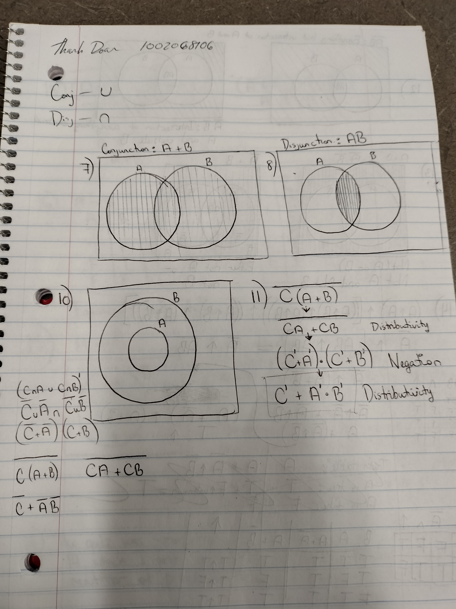
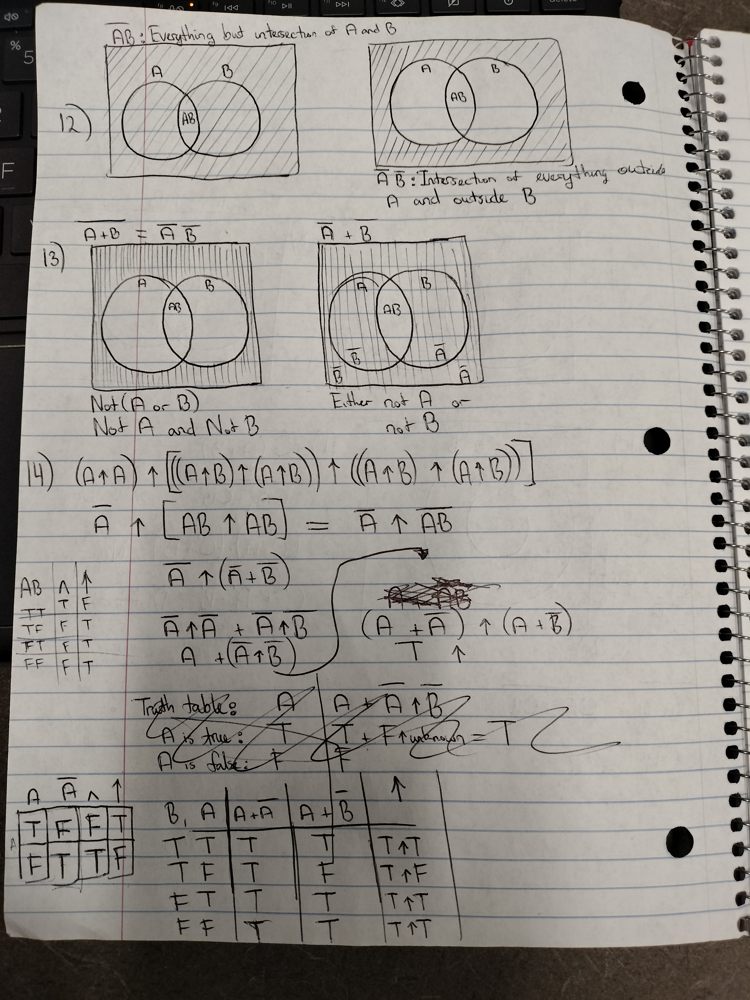
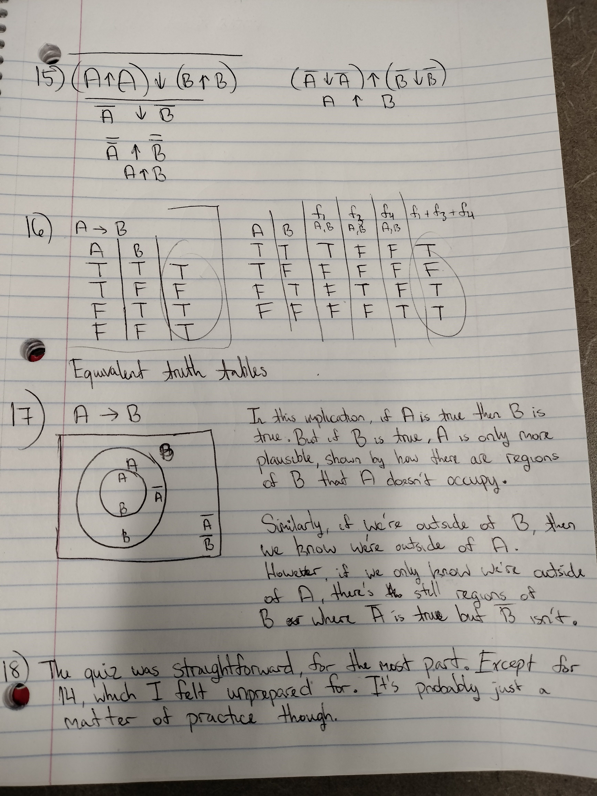

1. Observe the situation we're studying, model the interactions we've observed, and make predictions based on that model.
2. Experiment, theory, and computational and data science.
3. Bioinformatics, where the third pillar is used to manage data, run calculations to model the data, and make predictions or estimates of future trials. Computational physics relies on the third pillar for running large amounts of calculations and modeling simulations. Genomics, where sequencing millions of bases, can use computational and data science to make the process of sequencing and modeling the structure of genes easier.
4. Deductive and plausible reasoning. An example of deductive reasoning is to say that if my car got rear ended, then the back bumper would be damaged. Therefore, if my back bumper got damaged, then my car got rear ended. Plausible reasoning in this example would say that if my car's back bumper got damaged, then it's more likely that my car was rear-ended, but not the only possibility.
5. Logical implication is not the same as physical causation. If it rained today and was cloudy right before, the rain wasn't the cause of the clouds.
6. George Boole
9. If two Boolean propositions are equal, then they have the same truth value
10. 
11. 
12. 
