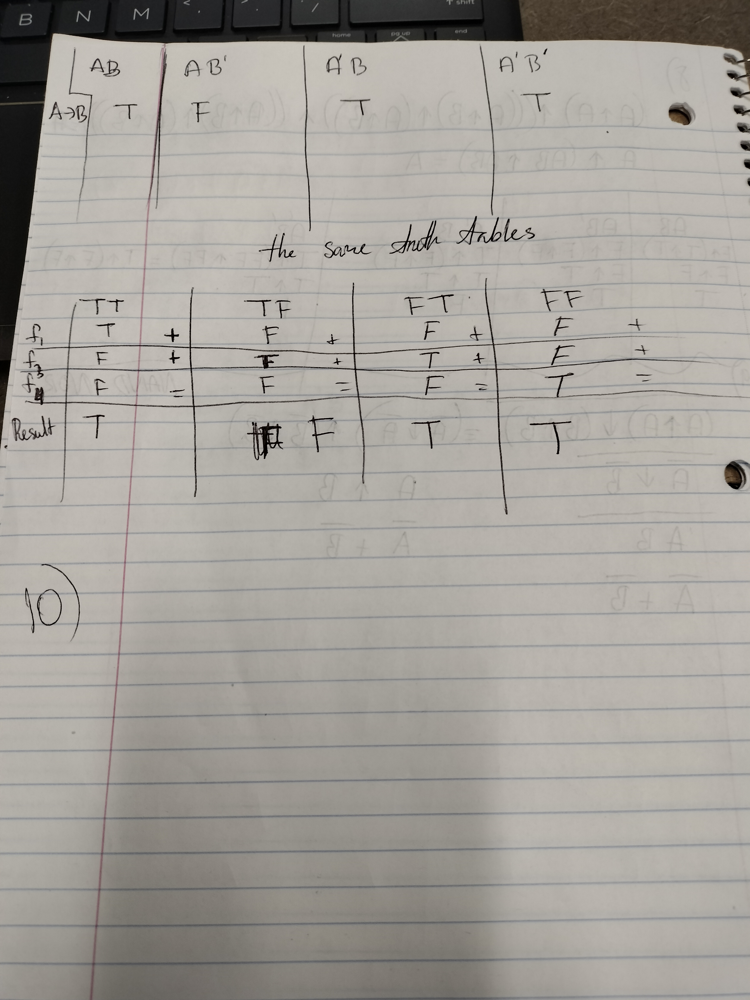
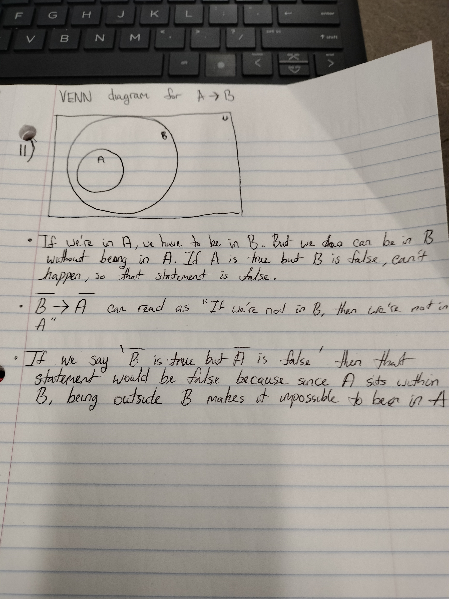

1. Classical, Bayesian, Frequentist, and Propensity.
2. Bayesian and Classical.
3. Bayesian and Classical.
4. Bayesian.
5. Ronald Fisher and Edwin Jaynes.
6. Either [0,1] or [1,infinity]. They are conventions from the first desiderata, which is representing probability using numbers, with more likely events being represented with greater numbers.
7. I can't trust either one of them. They are both trustworthy, but I can't be certain that they can distinguish between a donkey and a horse from distance. Any guess I make would be frequentist, since there's no way for me to reduce uncertainty without changing the experiment through things like asking them to describe the animal to me. This makes the uncertainty aleatoric.  

