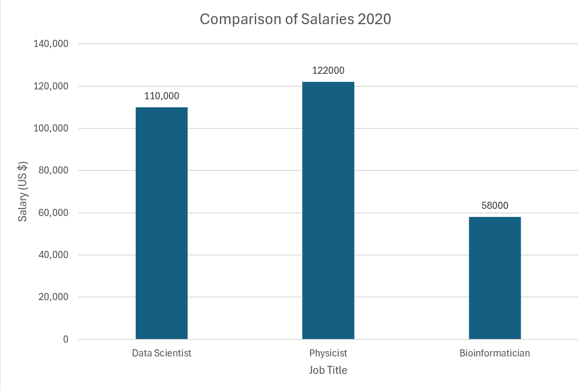

1. Graphical features of a data visualization, like color of datapoints, line style, and line weight.
2. Aesthetics that can represent continuous data and aesthetics that cannot.
3. Factors are variables holding qualitative data, and each factor can have different categories called levels.
4. Continuous and discrete
5. Factors.
6. Ratings going from good to bad would be considered ordered data, while names would be unordered.
7. Periodical/Cyclical data.
8. ggplot2 and other qualitative scales are used to distinguish discrete items that are unordered. Sequential scales like Heat are used to show difference in values and how distant two specific values are from each other. Diverging color scales like Carto Earth are used to show deviation from a center. And accent color scales like Okabe Ito are used to highlight important data points.
9. They don't offer much more information for how complicated they can be to read.
10. Dates can be simply used as categorical data for grouping events. But you can also perform mathematical operations on them, like determining date interval between two data points, making them numerical as well.
11. Both, depending on what type of color scale you're using. If the scale consists of random colors with no common values, they're categorical and only meant to distinguish discrete items. If it's a single hue that changes only in saturation/brightness, it can be used to represent the intensity of a numerical value. 
12. The red and black grid have parallel lines that don't seem to converge even as we extend them. The blue grid converges at the left end, so data points that fall in that area can't be distinguished from each other, making it invalid.
13. The bottom scale is more usable for people who are red-green colorblind.
14. San Diego seems to be the most even and centered circle on the chart, so I'd say that its temperature is the least varying. 
14b. Death Valley has a range of 90-60, so it varies the most.
14c. San Diego.
14d. San Diego.
15. a) Qualitative
    b) Sequential
    c) Diverging
    d) Accent
16. Accent
17. The slanted labels on the x-axis.
18. 
19. I think it will increase by around 2 degrees Celsius by 2050.